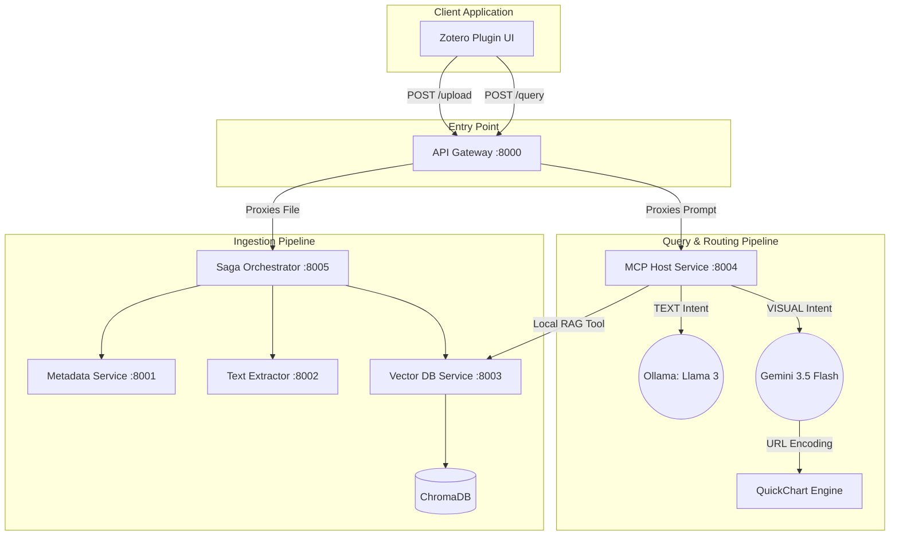

# Local Library Assistant

A Distributed Retrieval-Augmented Generation (RAG) Architecture for Zotero.

---

## 📖 Overview

The Local Library Assistant is an extension for Zotero designed for researchers and students. It leverages a local microservice architecture to ingest academic papers into a vector database (ChromaDB) and allows users to query their personal library using a local Large Language Model (Llama 3). 

For data visualization requests, the system routes the intent to a visual pipeline to deterministically generate academic-grade charts based on extracted document data.

---

## 🏗️ System Architecture

The system follows a strict distributed microservice architecture, separating the client UI, data ingestion (using the Saga Orchestration pattern), and AI routing.



### Microservice Directory
* **Port 8000 (API Gateway):** The single entry point bridging the Zotero UI with the backend network.
* **Port 8001 (Metadata Service):** Extracts and structures reference data from the incoming PDFs.
* **Port 8002 (Text Extractor):** Parses binary PDFs into clean, embeddable text chunks.
* **Port 8003 (Vector DB Service):** Interfaces directly with the ChromaDB instance.
* **Port 8004 (MCP Host Service):** The LangChain "brain" that classifies user intent and routes to the appropriate LLM pipeline.
* **Port 8005 (Saga Orchestrator):** Manages the distributed transaction of document ingestion to ensure data consistency.

---

## ✨ Core Features

* **Context-Menu Ingestion:** Right-click any PDF inside Zotero to securely extract, chunk, and embed its contents into your local vector database.
* **Privacy-First Text RAG:** Text-based questions are routed to a local Llama 3 instance, ensuring your research data never leaves your machine.
* **Deterministic Visualizations:** Requests for charts or diagrams trigger a dedicated Gemini pipeline that extracts data from your papers and renders mathematically accurate graphs via the QuickChart engine.
* **Native Zotero UI:** An integrated, interactive chat dialog built directly into the Zotero client framework.

---

## 🛠️ Prerequisites

To run this architecture locally, ensure your system meets the following requirements:
* **Operating System:** Linux (Ubuntu/Fedora recommended)
* **Containers:** Docker Desktop or Docker Engine (required for the Ollama container)
* **Frontend Runtime:** Node.js and npm
* **Backend Runtime:** Python 3.12+

---

## 🚀 Quick Start Guide

This project includes automated shell scripts to handle environment setup and execution without requiring manual terminal configuration.

### 1. Installation
Open your terminal in the root directory of the project and run the setup script. This will create a Python virtual environment and install all necessary backend and frontend dependencies.

```bash
chmod +x setup.sh
./setup.sh
```

### 2. Execution
Ensure your Docker daemon is running, then execute the orchestrator script. This will simultaneously boot the Llama container, all six Python microservices, and launch the Zotero plugin environment.

```bash
chmod +x start-library.sh
./start-library.sh
```
*(To safely shut down the entire system and close all ports, press `Ctrl+C` in the terminal).*

---

## 💡 Usage Instructions

1. **Ingest Papers:** Open Zotero, right-click on an item containing a PDF, and select **"Send to Local Library Assistant"**. Wait for the success popup confirming the chunks were saved.
2. **Open the Assistant:** Click the **Tools** menu in the top navigation bar and select **"Open Library Assistant"**.
3. **Query Text:** Ask a question about the papers you ingested. The system will retrieve the context and generate an answer locally.
4. **Generate Charts:** Paste a valid Google AI Studio API Key into the designated input box. Ask the assistant to "Generate a visual chart..." based on your papers, and the UI will render the data visualization directly in the chat.
