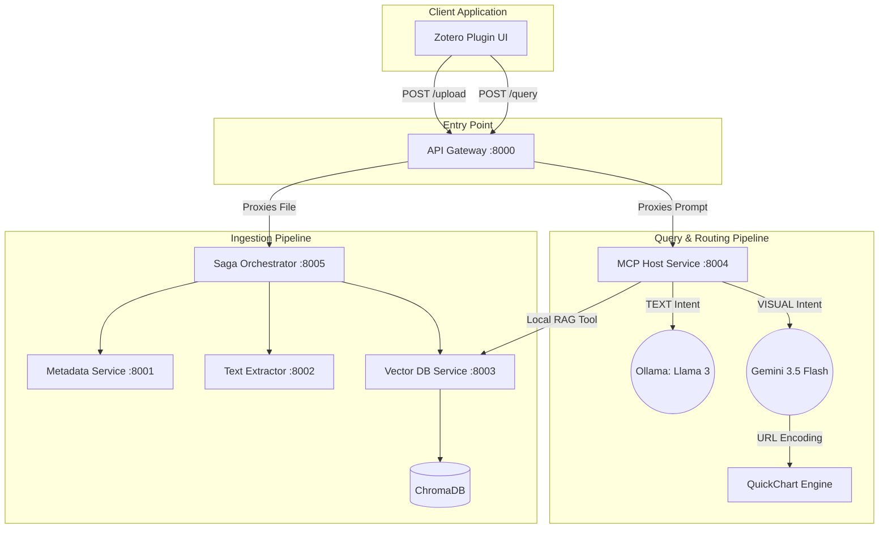

```mermaid
graph TD
    subgraph Client Application
        Zotero[Zotero Plugin UI]
    end

    subgraph Entry Point
        Gateway[API Gateway :8000]
    end

    subgraph Ingestion Pipeline
        Saga[Saga Orchestrator :8005]
        Meta[Metadata Service :8001]
        Extract[Text Extractor :8002]
        VectorSvc[Vector DB Service :8003]
        Chroma[(ChromaDB)]
    end

    subgraph Query & Routing Pipeline
        MCP[MCP Host Service :8004]
        Llama((Ollama: Llama 3))
        Gemini((Gemini 3.5 Flash))
        QuickChart[QuickChart Engine]
    end

    %% Frontend to Gateway
    Zotero -- "POST /upload" --> Gateway
    Zotero -- "POST /query" --> Gateway

    %% Upload Flow
    Gateway -- Proxies File --> Saga
    Saga --> Meta
    Saga --> Extract
    Saga --> VectorSvc
    VectorSvc --> Chroma

    %% Query Flow
    Gateway -- Proxies Prompt --> MCP
    MCP -- "Local RAG Tool" --> VectorSvc
    MCP -- "TEXT Intent" --> Llama
    MCP -- "VISUAL Intent" --> Gemini
    Gemini -- "URL Encoding" --> QuickChart
```
